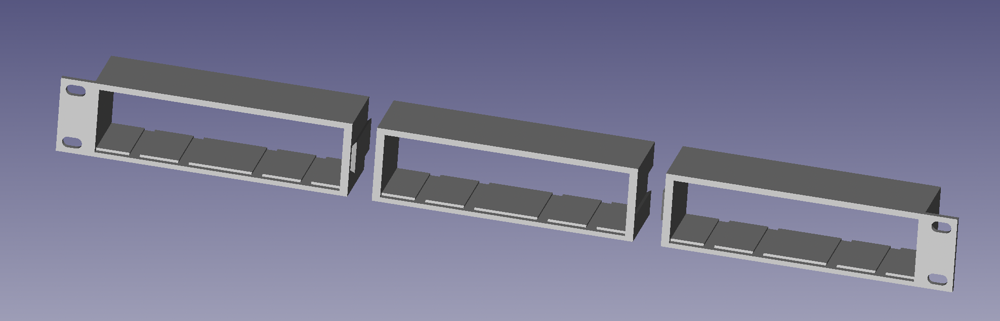
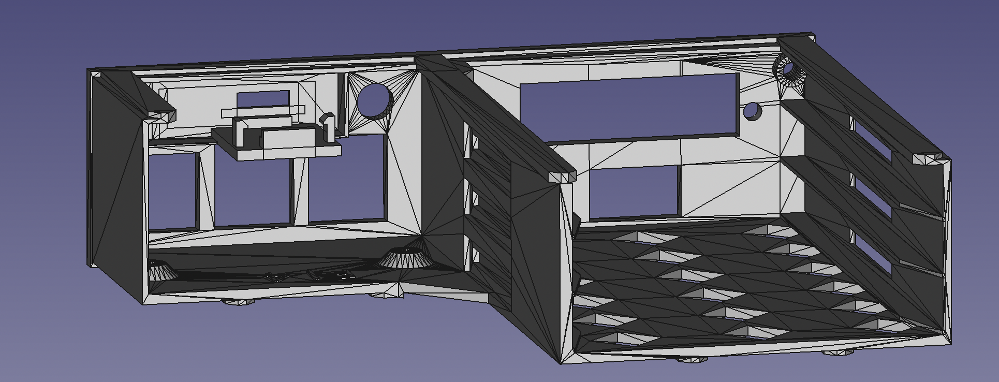
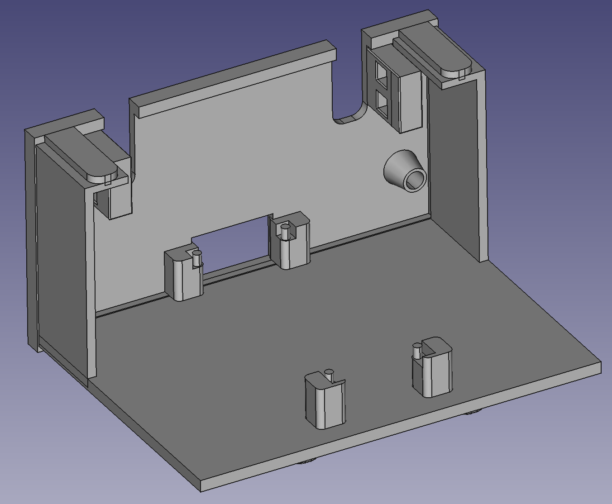
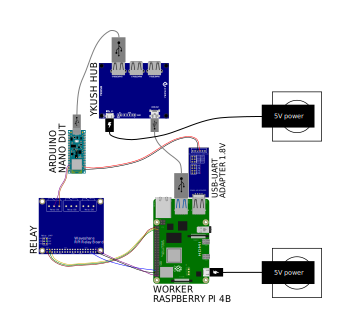

<!--
SPDX-FileCopyrightText: Huawei Inc.

SPDX-License-Identifier: CC-BY-4.0
-->
# Hardware Lab as a Service blueprint

## Devices Under Test - Arduino nano 33 BLE
Arduino nano 33 BLE is controlled by Lava worker installed on Raspberry Pi 4B. There's no requirements for it to be RPi4B but standardisation of setup of systems configurations, rack space, IaC, etc. for OSTC environment.

### Environment
- One of PoE+ [supported switches](https://gitlab.eclipse.org/pastanki/HLaaS/-/tree/main/hardware#supported-poe-switches)
- Ethernet cable
- [F2M jumper wires](https://www.amazon.pl/dp/B07K8PVKBP/?coliid=I2LIB46FB8EO4I&colid=EVVMW1H6DML2&psc=1&ref_=lv_ov_lig_dp_it)
- [F2F jumper wires](https://www.amazon.pl/dp/B07KYHBVR7/?coliid=I2E8ALNGLDOVFB&colid=EVVMW1H6DML2&psc=1&ref_=lv_ov_lig_dp_it)
- Rack cabinet (depends on your requirements)
- [3D printed shelf](https://gitlab.eclipse.org/pastanki/HLaaS/-/blob/main/3D_shelves/README.md): [left](../../3D_shelves/Rack%20-%20Left%20Side.stl), [midlle](../../3D_shelves/Rack_-_Middle_wider-Rack%20-%20Middle%20Wider.stl), [right](../../3D_shelves/Rack%20-%20Right%20Side.stl)

### Controlling host:
- Raspberry Pi 4 controlling host
- [USB/SATA interface](https://www.amazon.de/gp/product/B06XCV1W97)
- [Micro SD-card (32 GB)](https://www.amazon.com/Sandisk-Ultra-Micro-UHS-I-Adapter/dp/B073K14CVB)
- tty console and RS232 interface [Converter USB - TTL](https://elty.pl/pl/p/Konwerter-USB-na-RS232RS485TTL-z-izolacja./2468?utm_source=ceneo&utm_medium=referral)
- [cables](https://www.x-kom.pl/p/64439-kabel-zasilajacy-gembird-przedluzacz-c13-c14-18m.html)
- [power adaptors](https://www.x-kom.pl/p/263244-kabel-zasilajacy-gembird-kabel-schuko-c14-15cm.html)
- Ethernet cable
- [3D printed tray](../../3D_shelves/trpi4-1-rpi4-tray-all.stl)

- [3D printed tray for relay](../../3D_shelves/relay_tray-Relay_tray.stl)
  

### DUT setup:
- [Arduino nano 33 BLE](https://kamami.pl/arduino-oryginalne-plytki/576014-arduino-nano-33-ble-sense-ze-zlaczami-plytka-z-mikrokontrolerem-nrf52840-modulem-ble-i-czujnikami.html?search_query=arduino&results=1896)
- [YKUSH Yepkit USB 2.0 Swithcable Hub](https://www.yepkit.com/products/ykush)
- [USB to TTL UART converter](https://www.amazon.pl/dp/B07WX2DSVB/?coliid=I9VCAX8JCO5BS&colid=EVVMW1H6DML2&psc=1&ref_=lv_ov_lig_dp_it)
- [RPi4 relay HAT](https://botland.com.pl/rozszerzenia-gpio-do-raspberry-pi/6804-rpi-relay-board-3-przekazniki-nakladka-dla-raspberry-pi-waveshare-11638-5904422371753.html)
- [3D printed tray for Arduino](../../3D_shelves/Arduino_Nano_33_BLE_tray_alt-all.stl)

## Wiring
[tbd - update PSU to PoE]

## Contributing

See the `CONTRIBUTING.md` file.

## License
The license of this repository is as follows:

* Documentation text is under `CC-BY-4.0` license
* 3D printed designs of shelves and trays under `CC-BY-NC-SA-4.0` license
* Scripts, tools, and so on, are under `Apache-2.0` license
