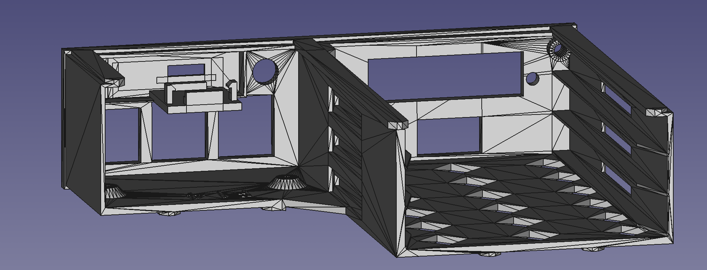

<!--
SPDX-FileCopyrightText: Huawei Inc.

SPDX-License-Identifier: CC-BY-4.0
-->
# Hardware Lab as a Service blueprint

## Devices Under Test

### Environment
- One of PoE+ [supported switches](https://gitlab.eclipse.org/pastanki/HLaaS/-/tree/main/hardware#supported-poe-switches)
- Ethernet cable
- [F2M jumper wires](https://www.amazon.pl/dp/B07K8PVKBP/?coliid=I2LIB46FB8EO4I&colid=EVVMW1H6DML2&psc=1&ref_=lv_ov_lig_dp_it)
- [F2F jumper wires](https://www.amazon.pl/dp/B07KYHBVR7/?coliid=I2E8ALNGLDOVFB&colid=EVVMW1H6DML2&psc=1&ref_=lv_ov_lig_dp_it)
- Rack cabinet (depends on your requirements)
- [3D printed shelf](https://gitlab.eclipse.org/pastanki/HLaaS/-/blob/main/3D_shelves/README.md): [left](../../3D_shelves/Rack%20-%20Left%20Side.stl), [midlle](../../3D_shelves/Rack_-_Middle_wider-Rack%20-%20Middle%20Wider.stl), [right](../../3D_shelves/Rack%20-%20Right%20Side.stl)

### Controlling host - can be shared with some other DUT
- Raspberry Pi 4 DUT
- [PoE+ HAT](https://www.amazon.de/gp/product/B0928ZD7QQ) - be sure to acquire proper one, with extended pins, otherwise you won't be able to connect wire jumpers to GPIO pins.
- [USB/SATA interface](https://www.amazon.de/gp/product/B06XCV1W97) and [SSD 2.5inch disk](https://www.euro.com.pl/dyski-wewnetrzne-ssd/kingston-a400-120gb.bhtml) OR [Micro SD-card (32 GB)](https://www.amazon.com/Sandisk-Ultra-Micro-UHS-I-Adapter/dp/B073K14CVB)
- [ykush3 USB switchable hub](https://www.yepkit.com/product/300110/YKUSH3)
- [ttl-usb interface](https://www.aliexpress.com/item/32786625237.html) -  the size of interface fits RPI tray. For controlling host this inteface is used for debugging purposes. Since it's not possible to connect HDMI connectors while raspberry pi is mounted on tray, we use ttl console. That should (but is not required) to be connected to some other host via USB or can be connected to some USB hub (we use [ICY box](https://www.amazon.com/Icy-Port-charge-port-Black/dp/B00TTNQQSY))
- [3D printed tray](../../3D_shelves/trpi4-1-rpi4-tray-all.stl)

### DUT setup
- Raspberry Pi 4 DUT
- [PoE+ HAT](https://www.amazon.de/gp/product/B0928ZD7QQ) - be sure to acquire proper one, with extended pins, otherwise you won't be able to connect wire jumpers to GPIO pins.
- [USB/SATA interface](https://www.amazon.de/gp/product/B06XCV1W97) and [SSD 2.5inch disk](https://www.euro.com.pl/dyski-wewnetrzne-ssd/kingston-a400-120gb.bhtml) OR [Micro SD-card (32 GB)](https://www.amazon.com/Sandisk-Ultra-Micro-UHS-I-Adapter/dp/B073K14CVB)
- [ttl-usb interface](https://www.aliexpress.com/item/32786625237.html) -  the size of interface fits RPI tray. Required.
- [3D printed tray](../../3D_shelves/trpi4-1-rpi4-tray-all.stl)

### Wiring

[tbd - update PSU to PoE]

## Contributing

See the `CONTRIBUTING.md` file.

## License

The license of this repository is as follows:

* Documentation text is under `CC-BY-4.0` license
* 3D printed designs of shelves and trays under `CC-BY-NC-SA-4.0` license
* Scripts, tools, and so on, are under `Apache-2.0` license
